# Cross Architecture
_**Alessandro Meo** - Nov. 7, 2020_

The **Cross Architecture** is a SW architecture approach inspired by the combination of some well-known design techniques, like the *multi-layer architecture*, the *Onion Architecture*, the *Clean Architecture* and the *DDD*.

The main idea that led me to the definition of the **Cross Architecture** was to describe a flexible way for designing the architecture of a SW over the actual application needs, while respecting a set of basic constraints providing good decoupling, testability and logical organization of code. Also, the same set of rules should provide a guidance for extending the architecture in order to follow potential application evolutions.

In practice, the above set of rules should be able to span and serve to rather different situations, hence the name **Cross Architecture**.

## General Concepts

The **Cross Architecture** can be represented by the following cross-shaped schema.

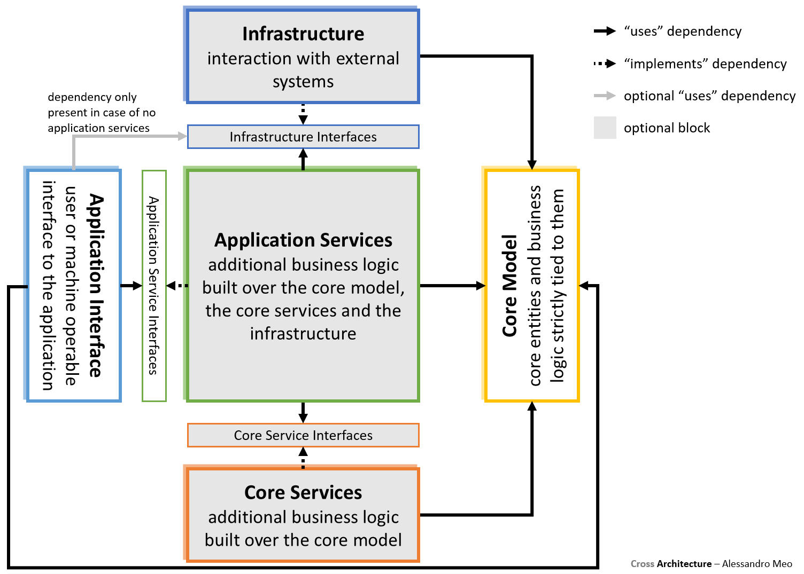

In the schema, each box represents a logical area that may be implemented by one or more SW blocks (either unrelated or organized in loosely coupled layers) or even by no SW block in case the box is marked as optional (gray background).

The compile time dependencies between the SW blocks are explicitly expressed, together with their intended use, by means of arrows among the holding boxes:
* a *“uses” dependency* means that the dependent block uses the pointed one, moreover, in case the pointed block is and interface block, one of its implementations is required to be injected into the dependent block (more precisely, this is about the contained classes);
* an *“implements” dependency* means that the dependent block implements the pointed one (more precisely, this is about the contained classes).

The dependency between the *Application Interface* and the *Infrastructure Interfaces* boxes is only present when no SW block implements the *Application Services* box.

## Composition Chain

The schema described in the previous section only deals with loosely coupled SW block sets implementing the application features, but, in order to complete the actual SW, the composition root code should be added.

For keeping a high level of flexibility, in the **Cross Architecture** the composition root code is split into several blocks (the ones holding the "U" and "I" letters), chained together in a nested reference tree called *Composition Chain*.

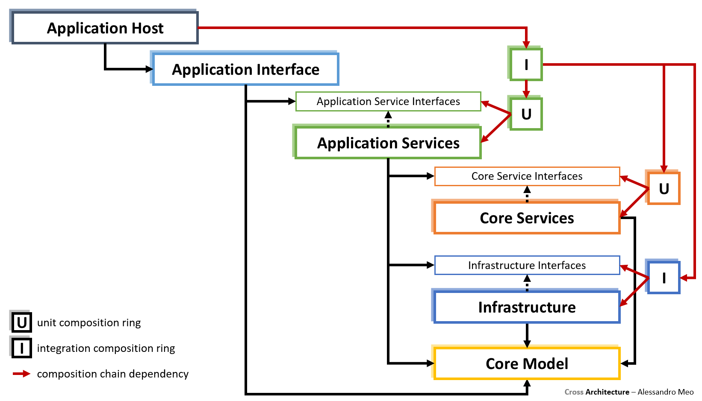

As shown above, the *Composition Chain* is rooted in the *Application Host*, whose responsibility is to build the SW layer stack and provide any configuration or action required for the application startup. The *Application Host* is the actual SW application entry point, built as a ready-to-run executable or potentially hosted inside an application server (e.g.: an HTTP server).

## Testing

Leveraging the *Composition Chain* technique makes it possible to implement isolated automated test blocks, easily referencing any unit or group of layers without composition code duplication.

Some examples about are shown in the following sub-sections.

### Unit Testing

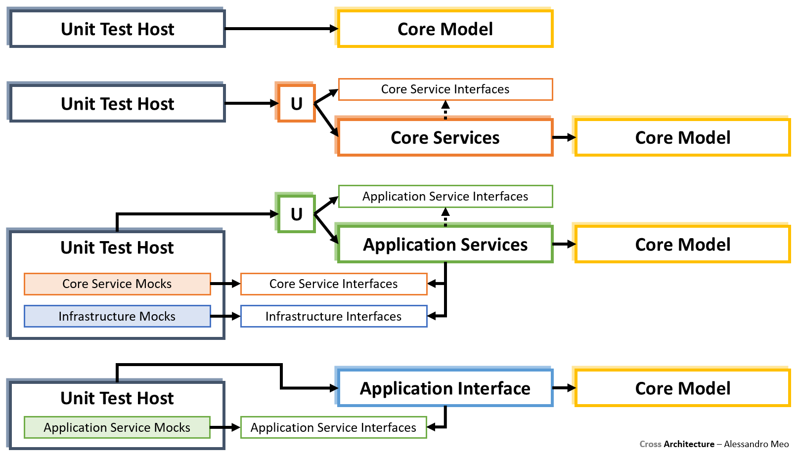

### Integration Testing

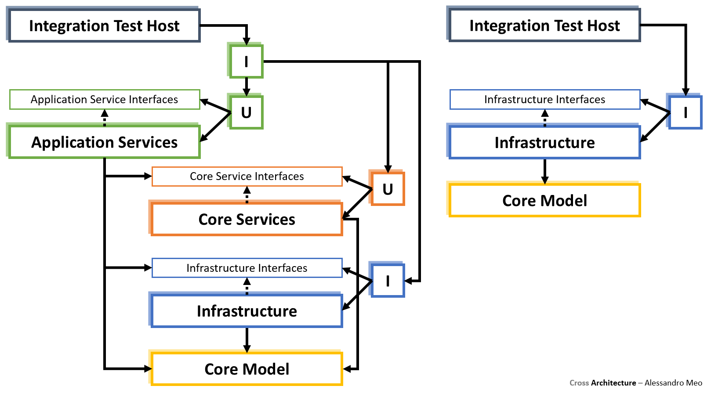

### Functional Testing

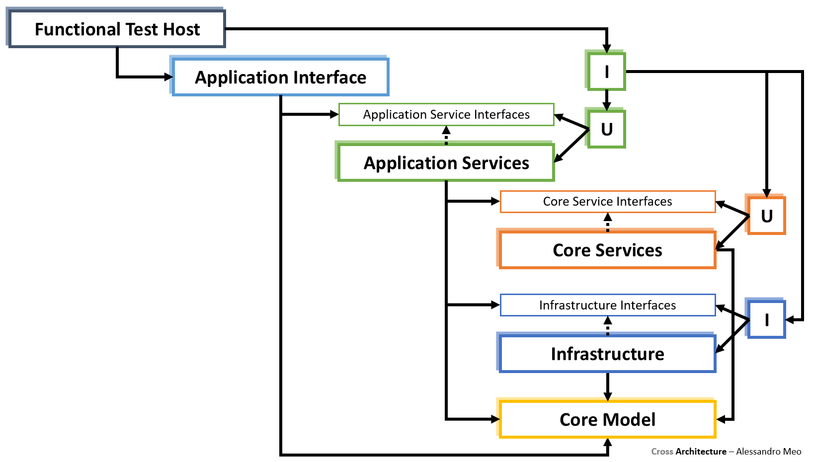

## Architecture Reduction

The most important aim of the **Cross Architecture** is to flexibly adapt to the actual application needs. This is done by the so called *Architecture Reduction*, which mainly implies:
1. dividing a logical area (box) into multiple SW blocks rather than implementing it as a single SW block;
2. making the internal design of the SW blocks more or less complex;
3. skipping the implementation of unrequired logical areas;
4. duplicating the whole architecture when deep separation between sub-contexts is required.

The next sub-sections present some examples of *Architecture Reduction* for some of the most common scenarios.

### DDD

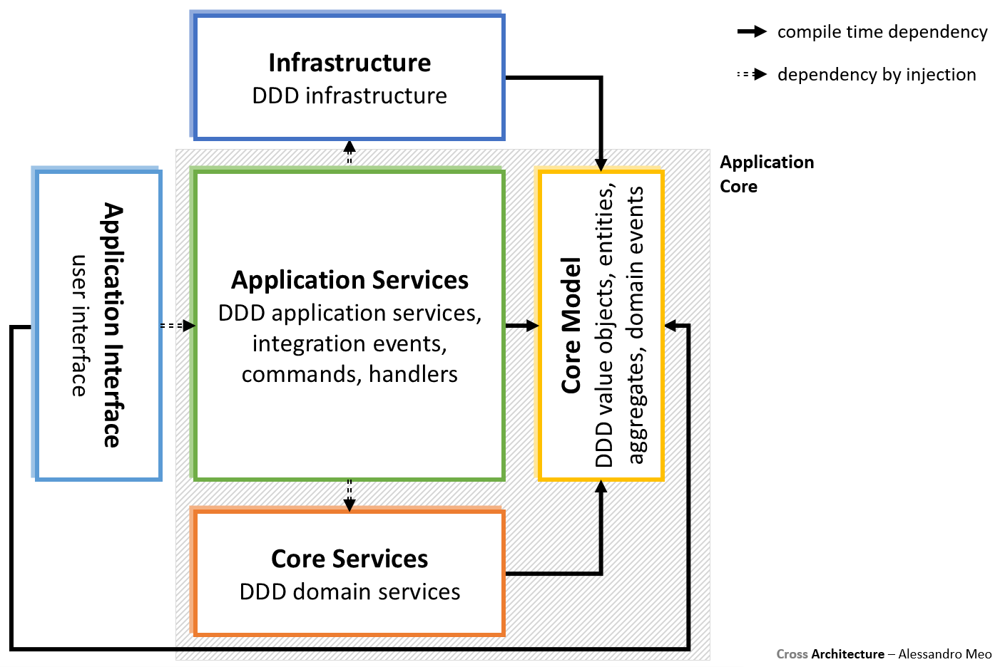

### Multi-Layer

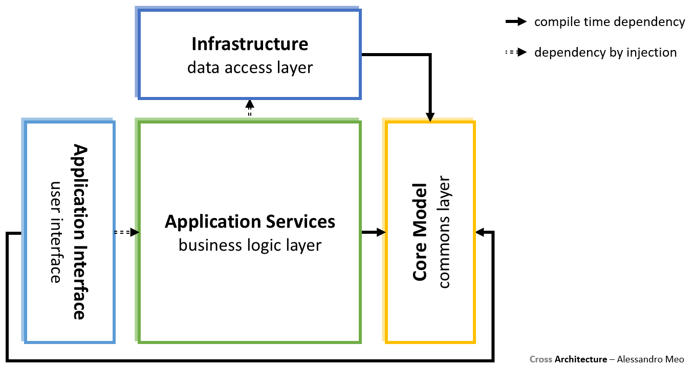

### Simple CRUD

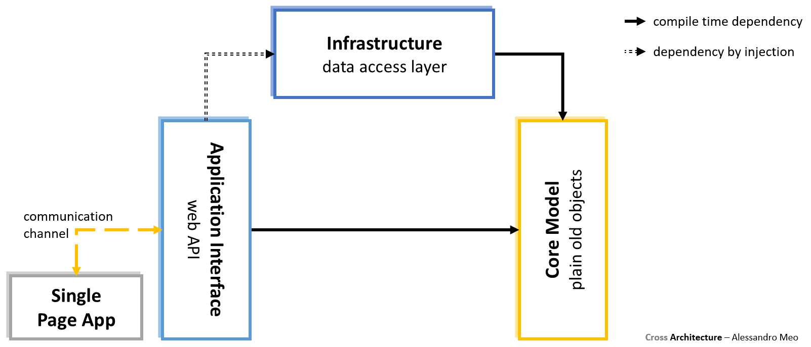

### Simple In-Memory

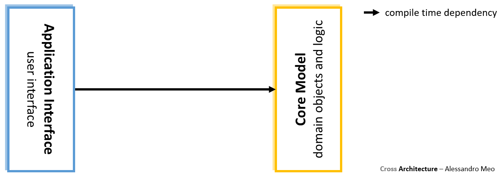

### SW Built Around a HW Device

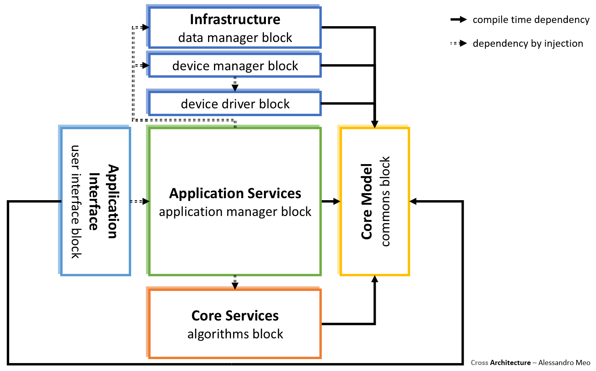

### Micro-Services

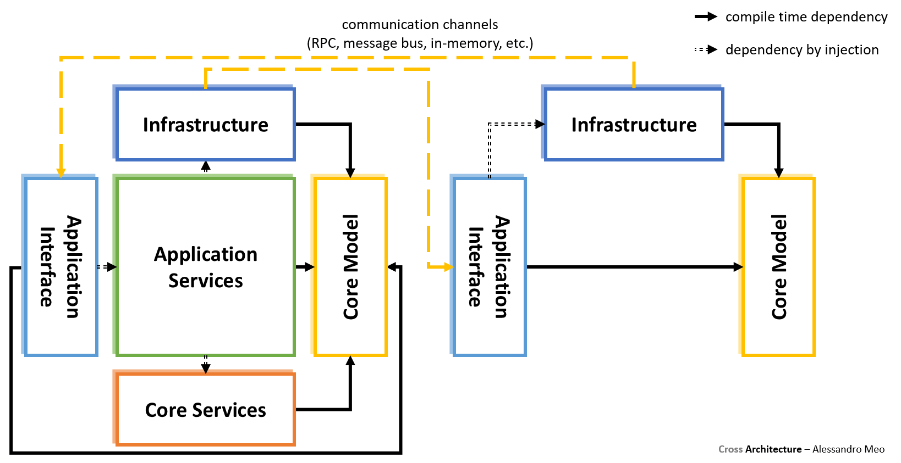
